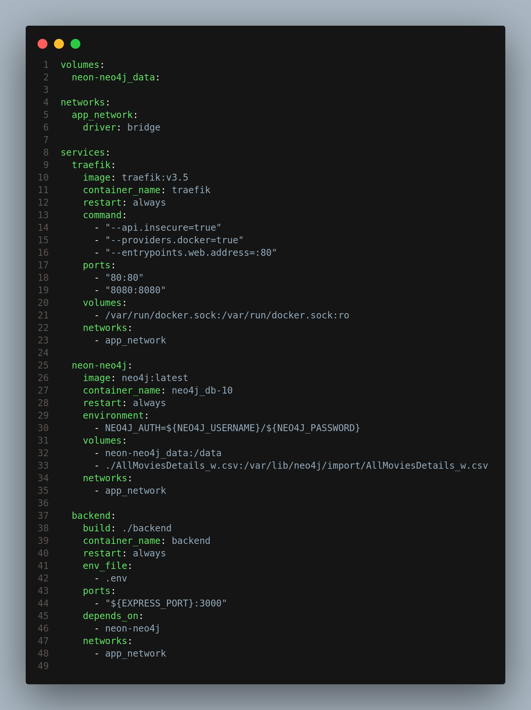
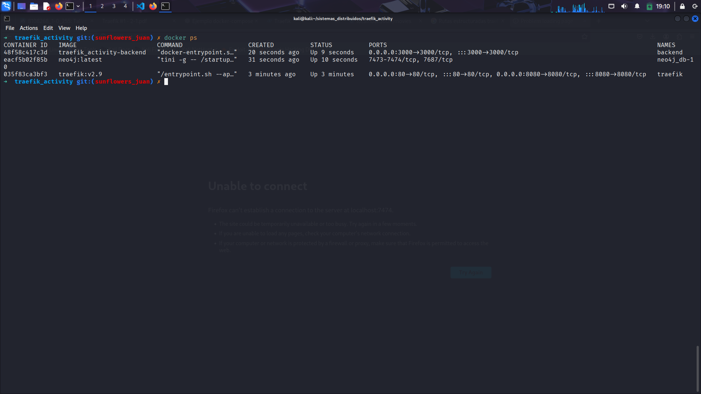
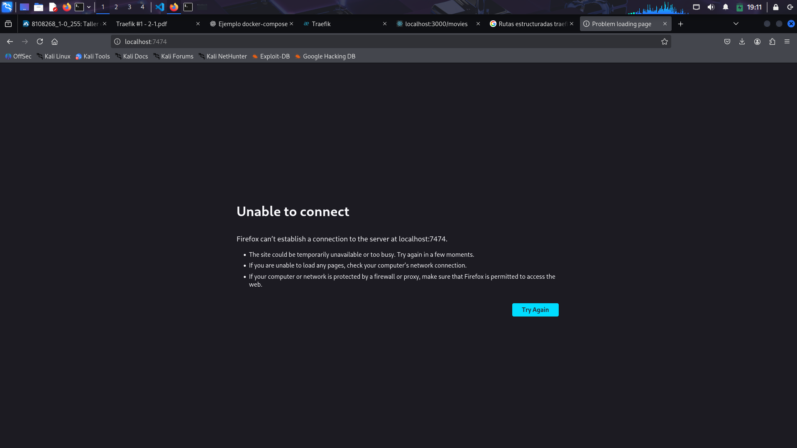
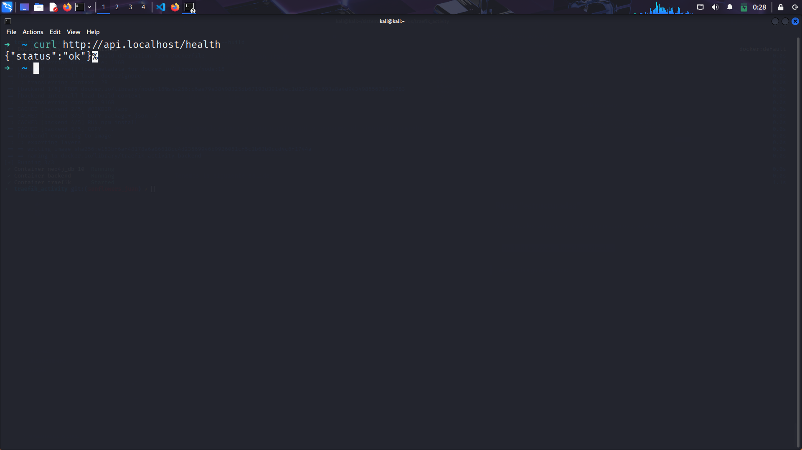
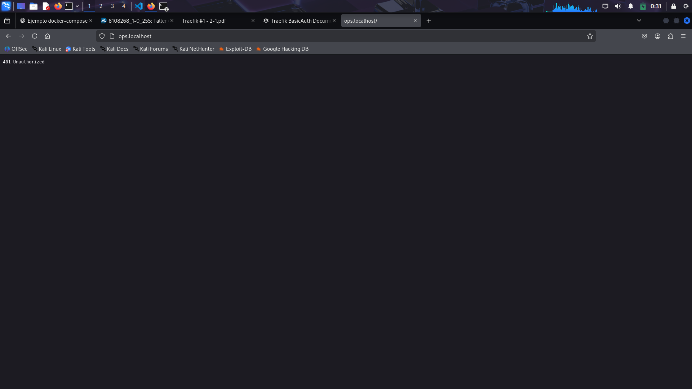
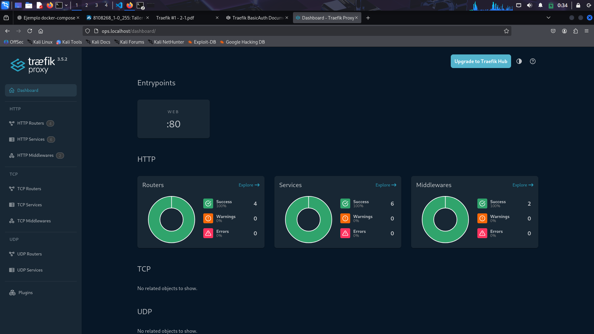
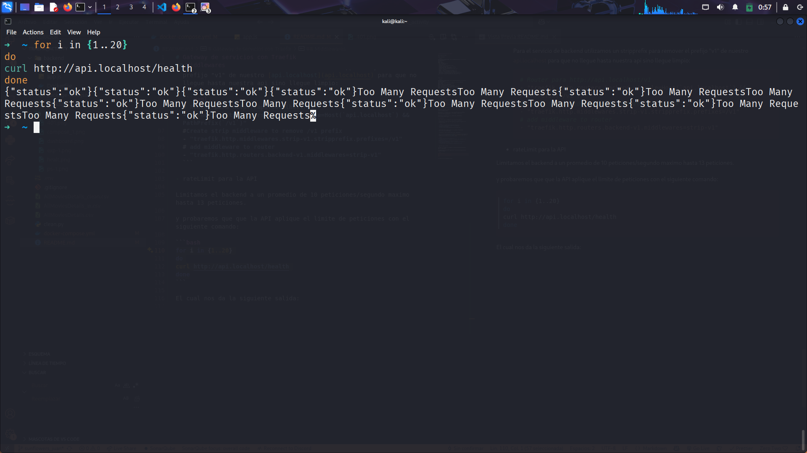
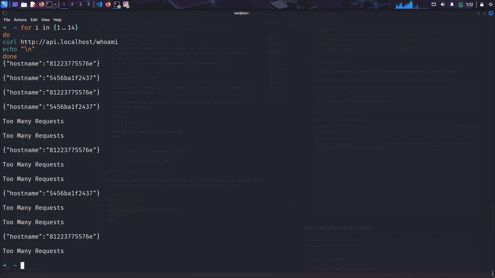

# Gateway de servicios con Traefik

Query para los datos

Cargar peliculas

```neon4j
LOAD CSV WITH HEADERS FROM 'file:///AllMoviesDetails_w.csv' AS row
FIELDTERMINATOR ';'
WITH row
LIMIT 10000
CREATE (m:Movie {
  id: toInteger(row.id),
  title: row.title,
  original_title: row.original_title,
  overview: row.overview,
  original_language: row.original_language,
  release_date: row.release_date,
  runtime: coalesce(toInteger(row.runtime), 0),
  status: row.status,
  budget: coalesce(toInteger(row.budget), 0),
  revenue: coalesce(toInteger(row.revenue), 0),
  popularity: coalesce(toFloat(row.popularity), 0.0),
  vote_average: coalesce(toFloat(row.vote_average), 0.0),
  vote_count: coalesce(toInteger(row.vote_count), 0)
});

```

crear nodos

```neon4j
LOAD CSV WITH HEADERS FROM 'file:///AllMoviesDetails_w.csv' AS row
FIELDTERMINATOR ';'
WITH row, split(row.production_companies, "|") AS companies
LIMIT 10000
MATCH (m:Movie {id: toInteger(row.id)})
UNWIND companies AS companyName
WITH m, trim(companyName) AS companyName
WHERE companyName <> "" AND companyName IS NOT NULL
MERGE (pc:ProductionCompany {name: companyName})
MERGE (m)-[:PRODUCED_BY]->(pc);
```

## Topologia y redes

Docker-Compose para punto 1


Neon4j no es accesible desde el host

Contenedor con la base de datos



Intentar ingresar desde el navegador al puerto



## Rutas “estructuradas”

Agregamos los routers para nuestra api y probamos el siguiente comando:

```bash
curl http://api.localhost/health
```

Tenemos la siguiente salida:


Configuramos el Midleware con el basic-Auth en nuestro traefik y verificamos que es inaccesible si no ponemos credenciales:


Ingresamos al dashboard con las credenciales configuradas:


## Middlewares

- Auth básica para el dashboard (ops.localhost/dashboard/).

  Establecemos el label del Basic Auth para nuestro Traefik con un usuario y clave:

  ```yaml
  - "traefik.http.middlewares.test-auth.basicauth.users=juan:$$2y$$05$$JVOriU0z8OoTTkfrSS7faOArKRTB.bukD0WRazqrb31Jmi3KAHFju,sunflowers:$$apr1$$d9hr9HBB$$4HxwgUir3HP4EsggP/QNo0"
  ```

  verificamos que es inaccesible si no ponemos credenciales:
  

- stripPrefix si usan prefijos tipo /api o /dashboard.

  Para el servicio de backend utilizamos un stripprefix para remover el prefijo "v1" de nuestro [api.localhost](api.localhost) para que no llegue hasta nuestra api sino llegue limpio:

  ```yaml
  # Router para http://api.localhost/v1
  - "traefik.http.routers.backend-v1.rule=Host(`api.localhost`) && PathPrefix(`/v1`)"
  #Create strip middleware to remove /v1 prefix
  - "traefik.http.middlewares.strip-v1.stripprefix.prefixes=/v1"
  # add middleware to router
  - "traefik.http.routers.backend-v1.middlewares=strip-v1"
  ```

- rateLimit para la API

  Limitamos el backend a un promedio de 10 peticiones/segundo maximo hasta 13 peticiones.

  y probaremos que que la API aplique el limite de peticiones con el siguiente comando:

  ```bash
  for i in {1..20}
  do
  curl http://api.localhost/health
  done
  ```

  El cual nos da la siguiente salida:

  

## Balanceo (réplicas de la API)

Levantamos dos instancias de nuestra API y con el endpoint /whoami que hemos creado verificaremos el hostname en nuestras peticiones:

```bash
for i in {1..14}
do
curl http://api.localhost/whoami
echo "\n"
done
```

tenemos la siguiente salida:



## Descubrimiento automático
