# Gateway de servicios con Traefik

Query para los datos

Cargar peliculas

```neon4j
LOAD CSV WITH HEADERS FROM 'file:///AllMoviesDetails_w.csv' AS row
FIELDTERMINATOR ';'
WITH row
LIMIT 10000
CREATE (m:Movie {
  id: toInteger(row.id),
  title: row.title,
  original_title: row.original_title,
  overview: row.overview,
  original_language: row.original_language,
  release_date: row.release_date,
  runtime: coalesce(toInteger(row.runtime), 0),
  status: row.status,
  budget: coalesce(toInteger(row.budget), 0),
  revenue: coalesce(toInteger(row.revenue), 0),
  popularity: coalesce(toFloat(row.popularity), 0.0),
  vote_average: coalesce(toFloat(row.vote_average), 0.0),
  vote_count: coalesce(toInteger(row.vote_count), 0)
});

```

crear nodos

```neon4j
LOAD CSV WITH HEADERS FROM 'file:///AllMoviesDetails_w.csv' AS row
FIELDTERMINATOR ';'
WITH row, split(row.production_companies, "|") AS companies
LIMIT 10000
MATCH (m:Movie {id: toInteger(row.id)})
UNWIND companies AS companyName
WITH m, trim(companyName) AS companyName
WHERE companyName <> "" AND companyName IS NOT NULL
MERGE (pc:ProductionCompany {name: companyName})
MERGE (m)-[:PRODUCED_BY]->(pc);
```

## Topologia y redes

Docker-Compose para punto 1


Neon4j no es accesible desde el host

Contenedor con la base de datos


Intentar ingresar desde el navegador al puerto


## Rutas “estructuradas”

Agregamos los routers para nuestra api y probamos el siguiente comando:

```bash
curl http://api.localhost/health
```

Tenemos la siguiente salida:


Configuramos el Midleware con el basic-Auth en nuestro traefik y verificamos que es inaccesible si no ponemos credenciales:


Ingresamos al dashboard con las credenciales configuradas:


## Middlewares

- Auth básica para el dashboard (ops.localhost/dashboard/).

  Establecemos el label del Basic Auth para nuestro Traefik con un usuario y clave:

  ```yaml
  - "traefik.http.middlewares.test-auth.basicauth.users=juan:$$2y$$05$$JVOriU0z8OoTTkfrSS7faOArKRTB.bukD0WRazqrb31Jmi3KAHFju,sunflowers:$$apr1$$d9hr9HBB$$4HxwgUir3HP4EsggP/QNo0"
  ```

  verificamos que es inaccesible si no ponemos credenciales:
  

- stripPrefix si usan prefijos tipo /api o /dashboard.

  Para el servicio de backend utilizamos un stripprefix para remover el prefijo "v1" de nuestro [api.localhost](api.localhost) para que no llegue hasta nuestra api sino llegue limpio:

  ```yaml
  # Router para http://api.localhost/v1
  - "traefik.http.routers.backend-v1.rule=Host(`api.localhost`) && PathPrefix(`/v1`)"
  #Create strip middleware to remove /v1 prefix
  - "traefik.http.middlewares.strip-v1.stripprefix.prefixes=/v1"
  # add middleware to router
  - "traefik.http.routers.backend-v1.middlewares=strip-v1"
  ```

- rateLimit para la API

  Limitamos el backend a un promedio de 10 peticiones/segundo maximo hasta 13 peticiones.

  y probaremos que que la API aplique el limite de peticiones con el siguiente comando:

  ```bash
  for i in {1..20}
  do
  curl http://api.localhost/health
  done
  ```

  El cual nos da la siguiente salida:

  

## Balanceo (réplicas de la API)

Levantamos dos instancias de nuestra API especificandolo en el docker-compose y con el endpoint /whoami que hemos creado verificaremos el hostname en nuestras peticiones:

```bash
for i in {1..14}
do
curl http://api.localhost/whoami
echo "\n"
done
```

tenemos la siguiente salida:


## Descubrimiento automático

Escalamos nuestra API utilizando:

```bash
docker compose up -d --scale backend=2
```

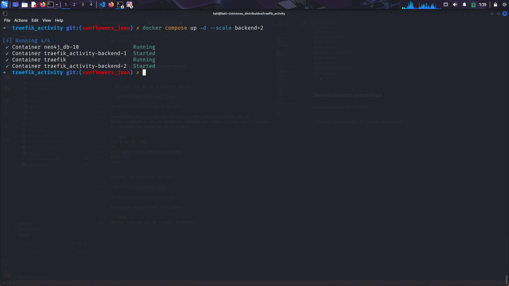

En el dashboard, dentro de Services, se visualiza el load balancer con 2
servidores registrados:

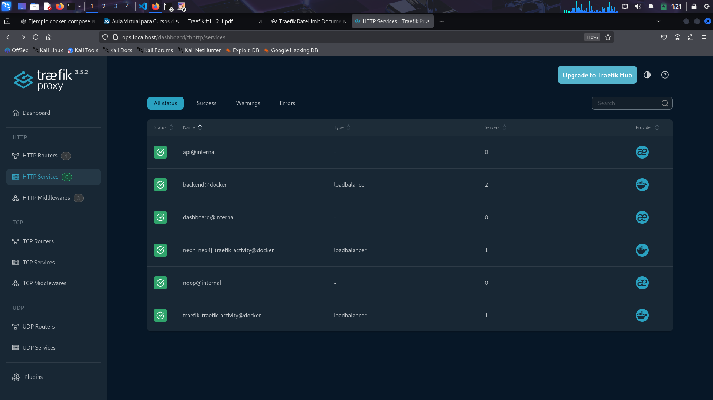

## Observabilidad y pruebas

- Endpoint /health en la API (200 OK).
  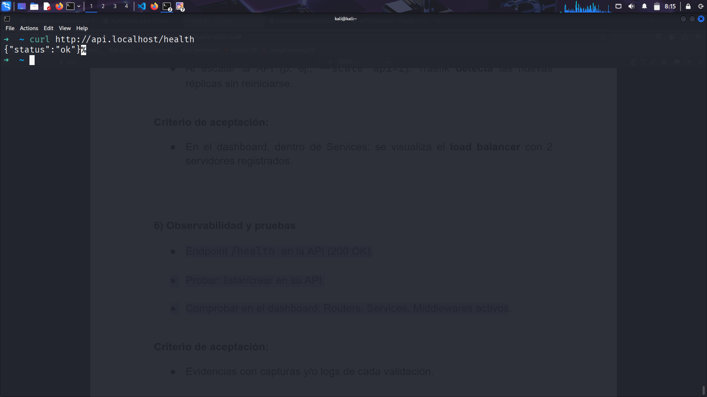

- Probar:
  - listar
    Se utilizara la siguiente peticion GET para listar nuestras peliculas
    ```bash
    curl -X GET http://api.localhost/movies
    ```
    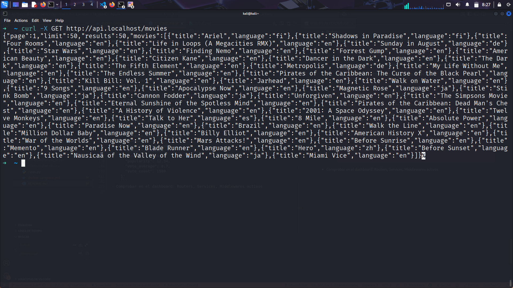
  - crear en su API.
    Se utilizara la siguiente peticion POST para crear una pelicula
    ```bash
    curl -X POST http://api.localhost/movies \
    -H "Content-Type: application/json" \
    -d '{
      "id": 99999,
      "title": "The Montecarlo Experiment",
      "original_title": "The Montecarlo Experiment",
      "overview": "Un experimento que sale mal.",
      "original_language": "en",
      "release_date": "15/09/2025",
      "runtime": 120,
      "status": "Released",
      "budget": 1000000,
      "revenue": 5000000,
      "popularity": 12.34,
      "vote_average": 8.7,
      "vote_count": 1500
    }'
    ```
    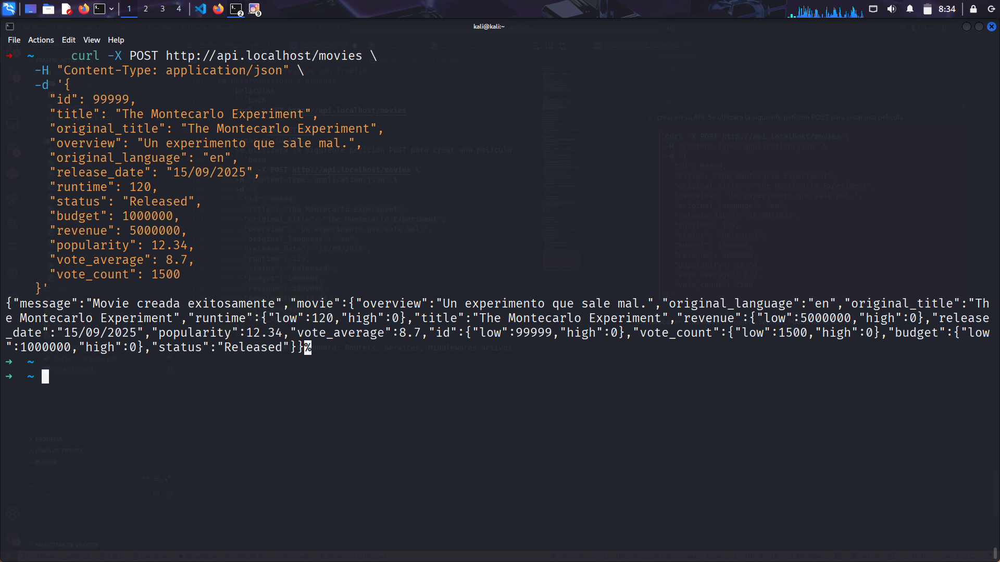
- Comprobar en el dashboard:

  - Routers
    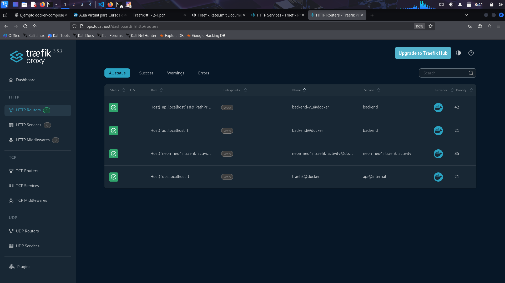

  - Services
    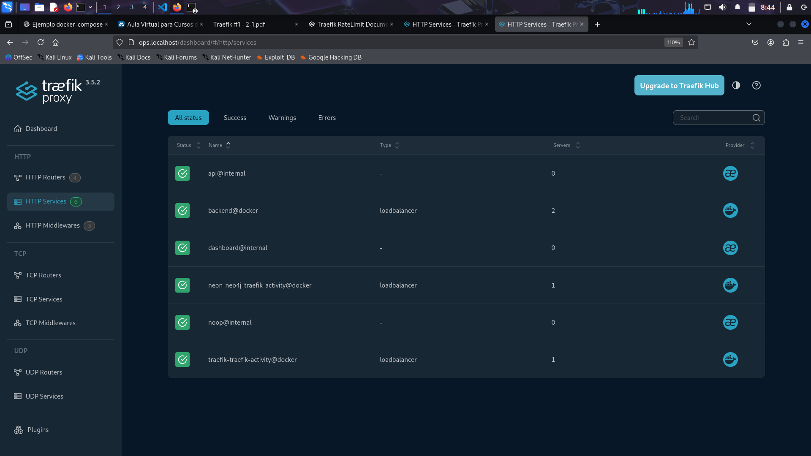

  - Middlewares activos
    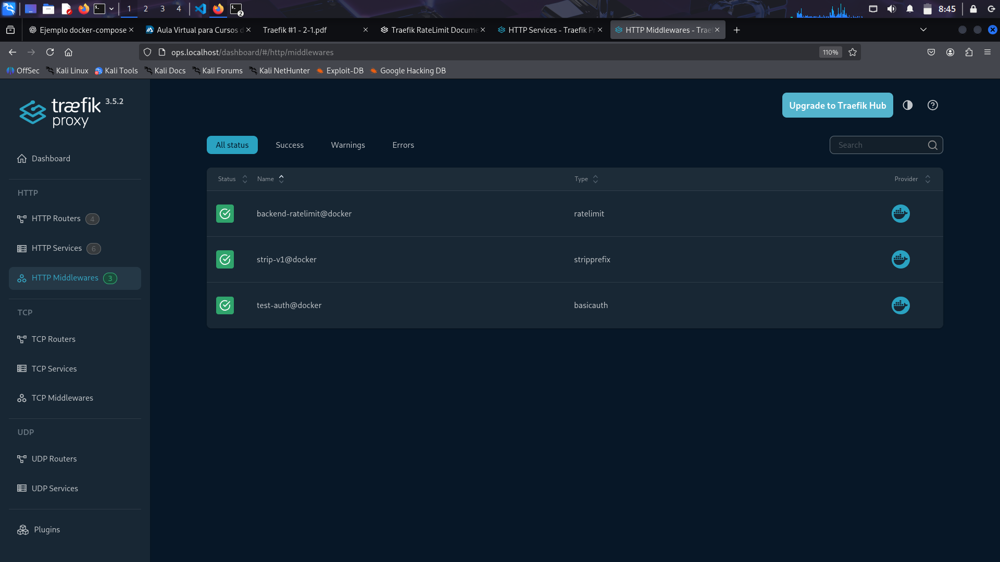`

### Host Usados:

Para el ejercicio se utilizaron los siguientes host:

- `api.localhost` para acceder a nuestro servicio de la API
- `ops.localhost` para acceder al dashboard de traefik unicamente desde este sitio

## Diagrama simple de la solucion

Tenemos el siguiente diagrama de la solucion:
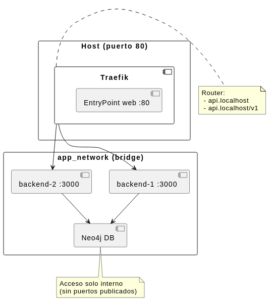`

En donde nuestro cliente accede desde el entrypoint que es el puerto 80 gestionado por tarefik el cual lo enruta mediante `api.localhost` o `api.localhost/v1` que nos redirigira a una de nuestras dos instancias del backend distribuyendo la carga y finalmente este backend accede a nuestra base de datos de neo4j segun la peticion que hayamos realizado.

## Breve reflexion Tecnica

- ¿Qué aporta Traefik frente a mapear puertos directamente?

  Traefik aporta ventajas frente a mapear puertos directamente porque centraliza el acceso a los servicios. En lugar de depender de puertos distintos para cada contenedor, puedo usar dominios o rutas limpias y fáciles de recordar que traefik gestiona de manera automatica. Además, Traefik permite balancear automáticamente las réplicas y descubrir nuevos servicios sin necesidad de reiniciar nada, lo que hace más sencilla la administración.

- ¿Qué middlewares usarían en producción y por qué?

  En producción considero útiles la autenticación básica, que es importante para proteger servicios internos, y el rate limiting ayuda a controlar la cantidad de peticiones y evitar ataques como DDOS.

- Riesgos de dejar el dashboard “abierto” y cómo mitigarlos.

  Dejar el dashboard abierto representa un riesgo porque muestra información sensible de la infraestructura. Esto podría ser aprovechado para ataques o accesos indebidos. Para mitigarlo lo mejor es restringir el acceso a redes internas y además habilitar autenticación, asegurando que solo personas autorizadas puedan entrar.

## Midleware Errors

Utilizaremos Nginx para redirigir a nuestras paginas de error que hemos creado.

Crearemos un bind mount `- ./error-pages:/usr/share/nginx/html:ro` con la carpeta que contiene nuestros html [404.html](error-pages/404.html) y [500.html](error-pages/404.html), luegro creamos un midleware de tipo error, y los codigos que debe interceptar. el exacto 404 y cualquier código entre 500 y 599. Si el backend responde con alguno de esos códigos, Traefik activará el middleware.

si intentamos hacer una peticion a `http//api.localhost/hola` que es una ruta que no existe. tenemos loa siguiente salida:

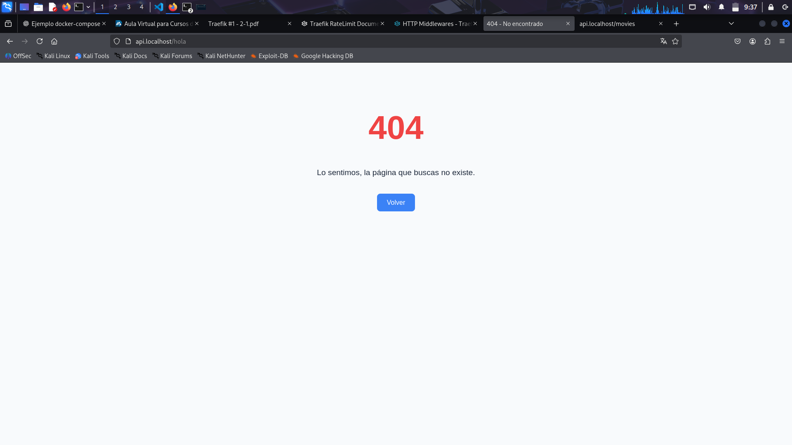

Luego para replicar el error 500, bajaremos el contenedor de la base de datos neo4j y luego intentaremos hacer nuestra peticion `/movies`
Tenemos la siguiente salida:

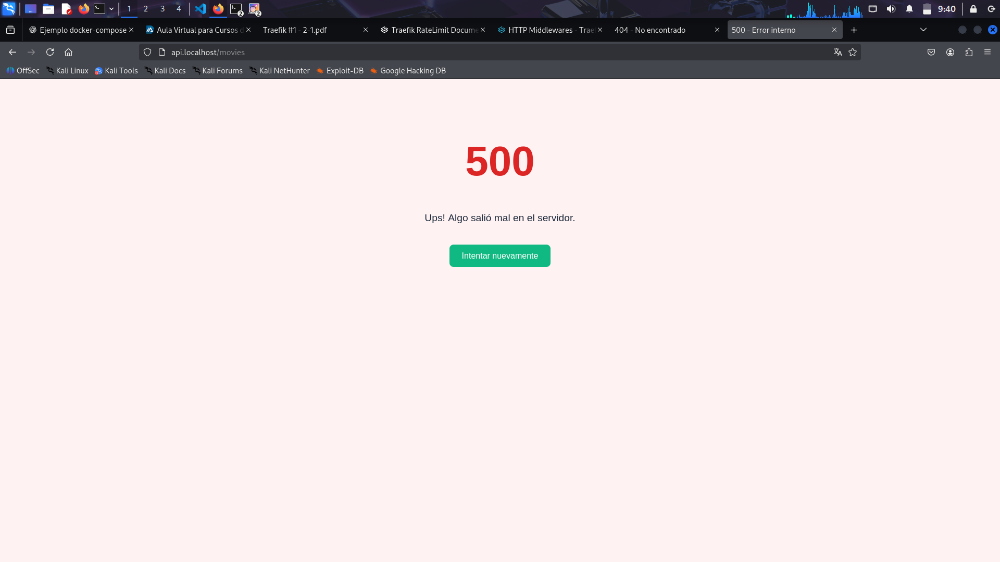
